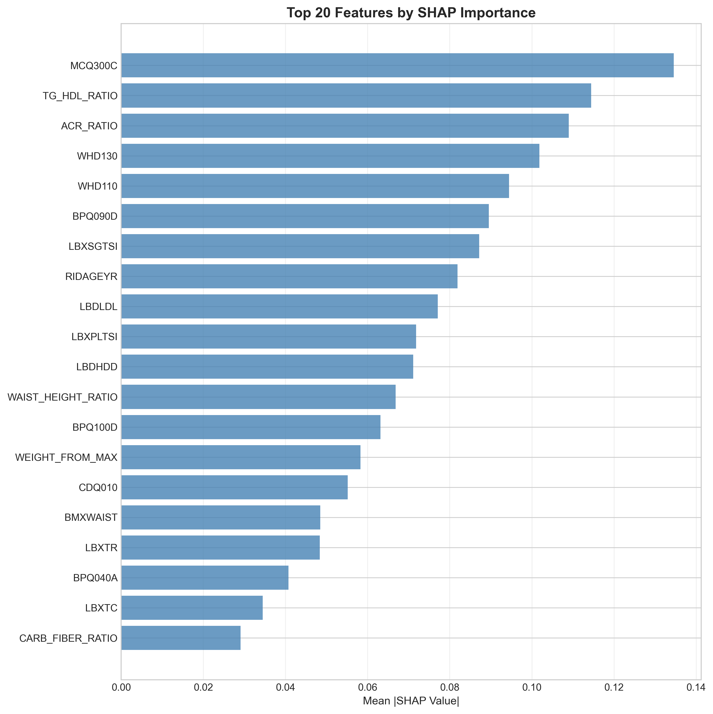
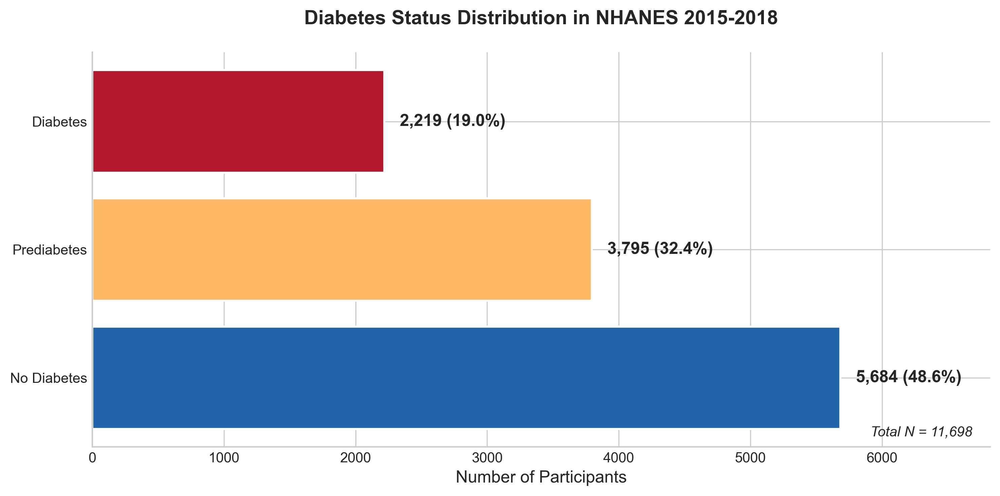
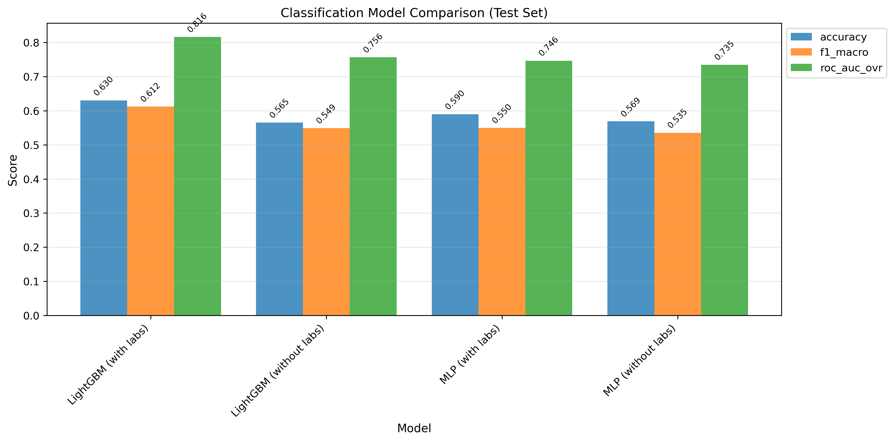
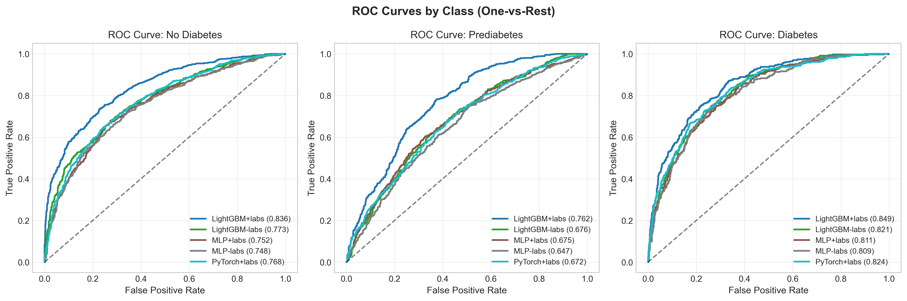
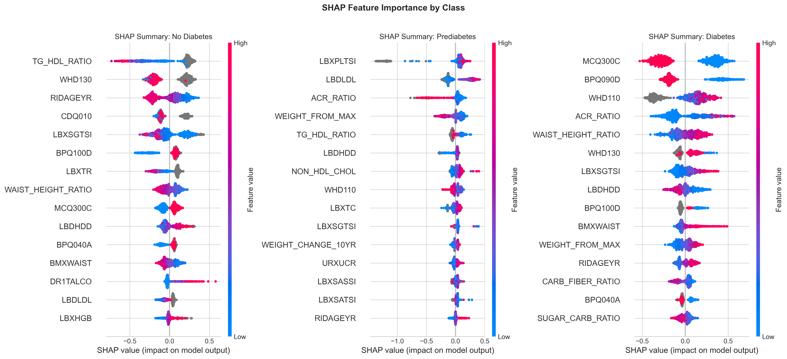
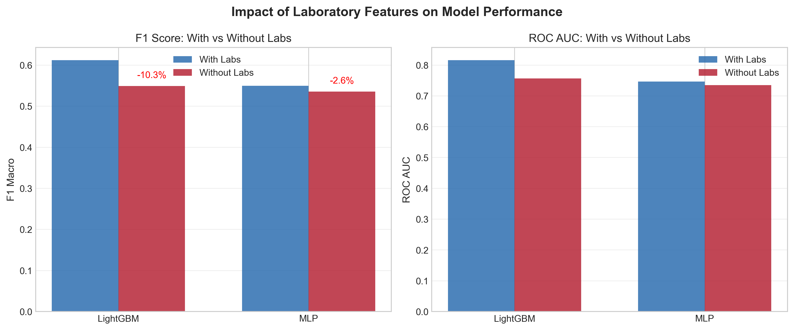

# Diabetes Risk Prediction Using NHANES Data


A comprehensive machine learning project that predicts diabetes status and risk using NHANES (National Health and Nutrition Examination Survey) data. This project demonstrates the complete data science lifecycle from raw data acquisition through model deployment.

<p align="center">
  
</p>

## Key Results

### Classification Performance (Test set, 3-class: No Diabetes / Prediabetes / Diabetes)

| Model | F1 Macro | ROC AUC (OvR) | Accuracy |
|-------|----------|---------------|----------|
| **LightGBM (with labs)** | **0.612** | **0.816** | **63.0%** |
| LightGBM (without labs) | 0.549 | 0.756 | 56.5% |
| MLP (with labs) | 0.550 | 0.746 | 59.0% |
| MLP (without labs) | 0.535 | 0.735 | 56.9% |

### Regression Performance (HbA1c Prediction, Test set)

| Model | RMSE | R² | MAE |
|-------|------|-----|-----|
| **LightGBM (with labs)** | **0.988** | **0.301** | **0.567** |
| LightGBM (without labs) | 1.080 | 0.164 | 0.609 |
| MLP (with labs) | 1.100 | 0.133 | 0.649 |
| MLP (without labs) | 1.163 | 0.031 | 0.682 |

### Key Finding

**Laboratory values improve classification by ~0.06 macro F1 (≈6 points)** while the model remains clinically useful without labs, enabling community-based screening without blood tests.

## Dataset

### NHANES Overview

The [National Health and Nutrition Examination Survey (NHANES)](https://www.cdc.gov/nchs/nhanes/index.htm) is a program of studies designed to assess the health and nutritional status of adults and children in the United States. The survey combines interviews, physical examinations, and laboratory tests.

### Study Population

| Metric | Value |
|--------|-------|
| Survey Years | 2015-2016, 2017-2018 |
| Total Participants | 11,698 |
| Age Range | 18-80 years |
| Features | 109 (with labs) / 92 (without labs) |

### Target Variable Distribution

| Class | N | Percentage |
|-------|---|------------|
| No Diabetes | 5,684 | 48.6% |
| Prediabetes | 3,795 | 32.4% |
| Diabetes | 2,219 | 19.0% |

<p align="center">
  
</p>

## Methodology

### Pipeline Overview

```
┌─────────────────┐    ┌─────────────────┐    ┌─────────────────┐
│  Data           │    │  Feature        │    │  Model          │
│  Acquisition    │───>│  Engineering    │───>│  Training       │
│  (NHANES CDC)   │    │  (22 derived)   │    │  (LightGBM)     │
└─────────────────┘    └─────────────────┘    └─────────────────┘
                                                      │
┌─────────────────┐    ┌─────────────────┐           │
│  Deployment     │<───│  Interpretation │<──────────┘
│  (Streamlit)    │    │  (SHAP)         │
└─────────────────┘    └─────────────────┘
```

### Feature Categories

| Category | Features | Examples |
|----------|----------|----------|
| Demographics | 2 | Age, Gender |
| Anthropometric | 4 | BMI, Weight, Height, Waist |
| Blood Pressure | 11 | Systolic/Diastolic readings, MAP, Pulse Pressure |
| Laboratory | 17 | Lipids, Kidney/Liver function, Blood counts |
| Lifestyle | 16 | Physical activity, Sleep, Smoking, Alcohol |
| Dietary | 19 | Nutrients, Eating behaviors |
| Medical History | 10 | CVD, Family history, Conditions |
| Mental Health | 10 | PHQ-9 Depression score |

### Derived Features (22 total)

Engineered features with clinical rationale:

- **Blood Pressure**: AVG_SYS_BP, AVG_DIA_BP, PULSE_PRESSURE, MAP, BP_VARIABILITY
- **Metabolic**: TG_HDL_RATIO (insulin resistance), NON_HDL_CHOL, ACR_RATIO (kidney)
- **Body Composition**: WAIST_HEIGHT_RATIO, WEIGHT_CHANGE_10YR, WEIGHT_FROM_MAX
- **Lifestyle**: PHQ9_SCORE (depression), ANY_CVD (cardiovascular composite)
- **Dietary**: CARB_FIBER_RATIO, SAT_FAT_PCT, SUGAR_CARB_RATIO

## Quick Start

### 1. Clone the repository

```bash
git clone https://github.com/yourusername/diabetes-prediction-nhanes.git
cd diabetes-prediction-nhanes
```

### 2. Create and activate conda environment

```bash
conda env create -f environment.yml
conda activate diabetes-ml
```

Or using pip:

```bash
python -m venv venv
source venv/bin/activate  # On Windows: venv\Scripts\activate
pip install -r requirements.txt
```

### 3. Download NHANES data

```bash
python -m src.data.download --years 2015-2016 2017-2018
```

### 4. Generate features and models

Run the notebooks in order to create `data/processed/` and `models/advanced/` artifacts:

1. `02_data_exploration.ipynb`
2. `03_data_cleaning.ipynb`
3. `04_feature_engineering.ipynb`
4. `05_eda_visualizations.ipynb`
5. `06_baseline_models.ipynb`
6. `07_advanced_models.ipynb`
7. `08_evaluation_and_interpretation.ipynb`

### 5. Run the Streamlit app

```bash
streamlit run app/streamlit_app.py
```

### 6. Explore the notebooks (optional)

Start with the notebooks in order:
1. `02_data_exploration.ipynb` - Data profiling and target definition
2. `03_data_cleaning.ipynb` - Missing data handling
3. `04_feature_engineering.ipynb` - Derived features
4. `05_eda_visualizations.ipynb` - Exploratory analysis
5. `06_baseline_models.ipynb` - Baseline benchmarks
6. `07_advanced_models.ipynb` - LightGBM and MLP training
7. `08_evaluation_and_interpretation.ipynb` - SHAP analysis

## Reproducibility

This repository does **not** include raw data, processed datasets, or trained models. The app expects locally generated artifacts in `data/processed/` and `models/advanced/`.

To reproduce everything from scratch:

1. Complete the Quick Start setup and download steps.
2. Run the notebooks in order (`02` through `08`) to regenerate processed datasets, train models, and create evaluation artifacts.
3. Confirm the following paths exist before running the app:
`data/processed/` and `models/advanced/`

## Repository Structure

```
diabetes_prediction_project/
├── app/
│   ├── streamlit_app.py          # Interactive web application
│   ├── feature_order.json        # Tracked feature order for inference
│   └── requirements.txt          # App dependencies
│
├── config/
│   ├── config.yaml               # Central configuration
│   └── file_mappings.yaml        # NHANES file name mappings
│
├── data/
│   ├── raw/                      # Original XPT files (gitignored)
│   ├── interim/                  # Intermediate processing
│   └── processed/                # Final modeling datasets
│
├── models/
│   ├── baseline/                 # Baseline model artifacts
│   └── advanced/                 # LightGBM, MLP, PyTorch models
│
├── notebooks/
│   ├── 02_data_exploration.ipynb
│   ├── 03_data_cleaning.ipynb
│   ├── 04_feature_engineering.ipynb
│   ├── 05_eda_visualizations.ipynb
│   ├── 06_baseline_models.ipynb
│   ├── 07_advanced_models.ipynb
│   ├── 07a_deep_learning_pytorch.ipynb
│   └── 08_evaluation_and_interpretation.ipynb
│
├── reports/
│   ├── figures/                  # All visualizations (60+ figures)
│   ├── metrics/                  # Tracked evaluation summaries
│   └── final_report.md           # Comprehensive project report
│
├── src/
│   ├── data/                     # Data loading and cleaning
│   ├── features/                 # Feature engineering
│   ├── models/                   # Training and evaluation
│   ├── visualization/            # Plotting functions
│   └── utils/                    # Helper utilities
│
├── CHANGELOG.md                  # Detailed project history
├── prd.md                        # Product requirements document
├── requirements.txt              # Python dependencies
└── environment.yml               # Conda environment
```

## Results & Visualizations

### Model Performance

<p align="center">
  
</p>

### ROC Curves by Class

<p align="center">
  
</p>

### SHAP Feature Importance

<p align="center">
  
</p>

### With Labs vs Without Labs

<p align="center">
  
</p>

### Top Risk Factors

<p align="center">
  
</p>

## Try the Model

### Streamlit Application

The interactive web app allows you to:
- Enter your own health metrics for a personalized risk prediction
- View example test cases spanning low to high risk profiles
- Compare predictions with and without laboratory values
- Explore population-level insights from NHANES data

```bash
streamlit run app/streamlit_app.py
```

### Example Predictions

| Profile | Age | BMI | With Labs | Without Labs |
|---------|-----|-----|-----------|--------------|
| Healthy Adult | 32 | 22 | Prediabetes (52%) | Prediabetes |
| Metabolic Syndrome | 62 | 34 | Diabetes (63%) | Diabetes |
| Active Senior | 58 | 24 | No Diabetes | No Diabetes |

## Disclaimer

This project is for educational and research purposes only and does not provide medical advice, diagnosis, or treatment. Always consult a qualified healthcare professional for medical guidance.

## Actionable Insights

### Top Modifiable Risk Factors

Based on SHAP analysis, the most impactful factors you can change:

1. **Waist-to-height ratio** - Keep below 0.5
2. **BMI** - Maintain healthy weight (18.5-24.9)
3. **Blood pressure** - Target <120/80 mmHg
4. **TG/HDL ratio** - Target <3.0 (requires lab work)
5. **Physical activity** - Regular moderate-vigorous exercise
6. **Diet quality** - Improve carb/fiber ratio (<15)

### Clinical Implications

- **Community Screening**: The without-labs model enables risk assessment without blood tests
- **Early Intervention**: Prediabetes detection allows lifestyle modification before progression
- **Personalized Risk**: Individual SHAP values explain why someone is high/low risk

## Documentation

- **[CHANGELOG.md](CHANGELOG.md)** - Detailed project history with decisions and learnings
- **[prd.md](prd.md)** - Product requirements document with full specifications
- **[Final Report](reports/final_report.md)** - Comprehensive analysis and findings

## Technical Stack

| Category | Tools |
|----------|-------|
| **Data Processing** | pandas, numpy, pyreadstat |
| **Machine Learning** | scikit-learn, LightGBM, PyTorch |
| **Hyperparameter Tuning** | Optuna |
| **Experiment Tracking** | MLflow |
| **Interpretation** | SHAP |
| **Visualization** | matplotlib, seaborn, plotly |
| **Deployment** | Streamlit |

## Future Work

- [ ] Expand to full NHANES dataset (1999-2018) for more training data
- [ ] Add temporal validation (train on older years, test on recent)
- [ ] Implement calibrated probability estimates
- [ ] Add more interaction features (BMI × Age, Activity × Sedentary)
- [ ] Deploy as REST API with FastAPI
- [ ] Create mobile-friendly web interface

## Contributing

Contributions are welcome! Please feel free to submit a Pull Request.

1. Fork the repository
2. Create your feature branch (`git checkout -b feature/AmazingFeature`)
3. Commit your changes (`git commit -m 'Add some AmazingFeature'`)
4. Push to the branch (`git push origin feature/AmazingFeature`)
5. Open a Pull Request

## License

This project is licensed under the MIT License - see the [LICENSE](LICENSE) file for details.

## Acknowledgments

- **NHANES** - National Center for Health Statistics, CDC
- **SHAP** - Lundberg & Lee for the interpretability framework
- **LightGBM** - Microsoft for the gradient boosting framework

## Contact

**Tim Hall**

- GitHub: [@timhall33](https://github.com/timhall33)
- LinkedIn: [timothy-hall](https://www.linkedin.com/in/timothy-hall-4d7)

---

<p align="center">
  <i>This project demonstrates end-to-end machine learning skills including data engineering, feature engineering, model development, evaluation, interpretation, and deployment.</i>
</p>
