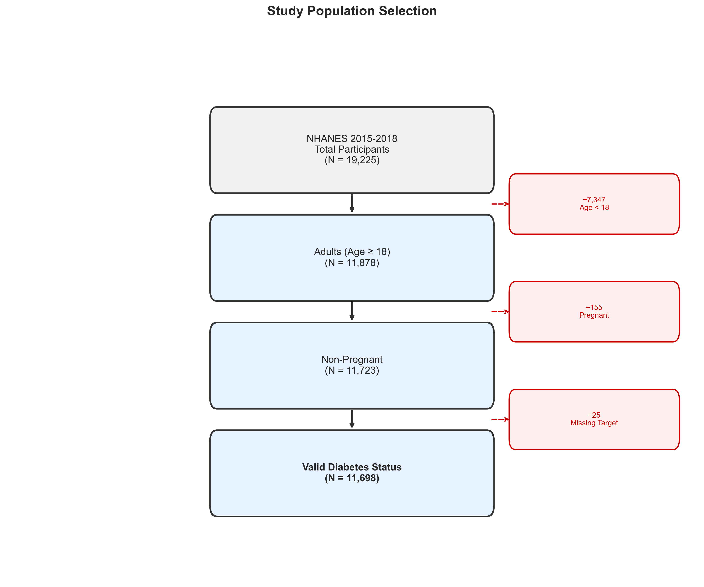
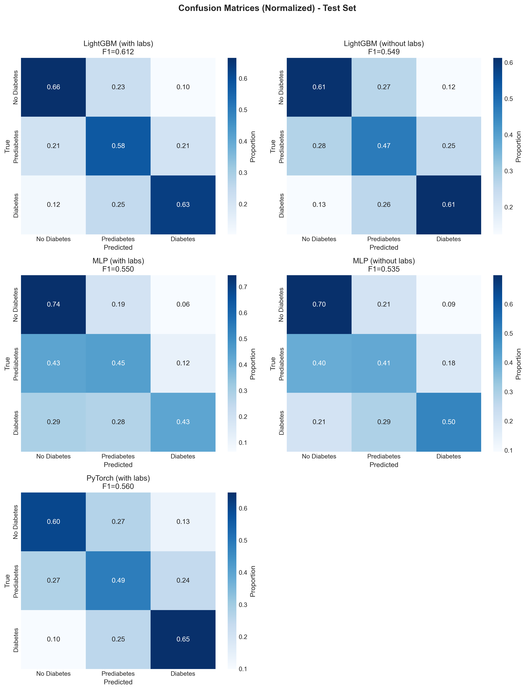
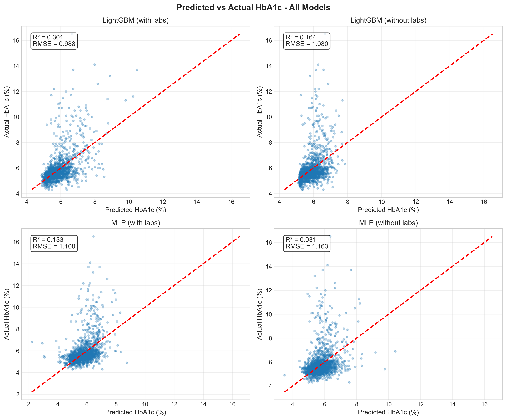
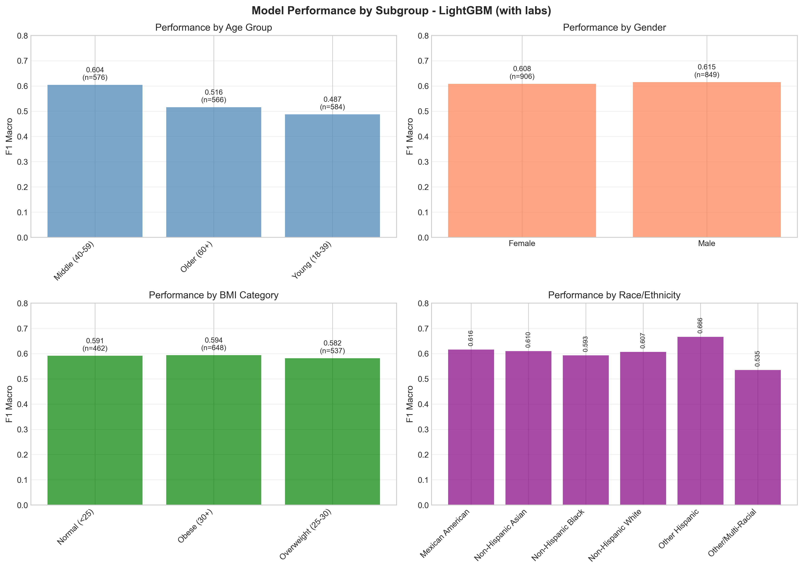
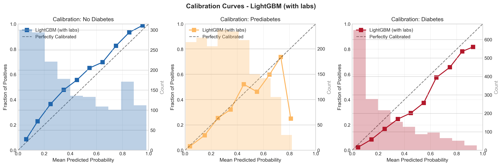
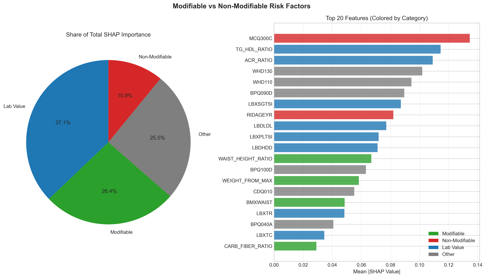

# Diabetes Risk Prediction Using NHANES Data
## Final Project Report

**Author**: Tim Hall
**Date**: February 2026
**Version**: 1.0

---

## Table of Contents

1. [Executive Summary](#executive-summary)
2. [Introduction](#introduction)
3. [Data](#data)
4. [Methodology](#methodology)
5. [Results](#results)
6. [Model Interpretation](#model-interpretation)
7. [Discussion](#discussion)
8. [Limitations](#limitations)
9. [Future Work](#future-work)
10. [Conclusion](#conclusion)
11. [References](#references)
12. [Appendix](#appendix)

---

## Executive Summary

This project developed machine learning models to predict diabetes status using data from the National Health and Nutrition Examination Survey (NHANES). Using 11,698 adult participants from the 2015-2018 survey cycles, we built models that classify individuals into three categories: No Diabetes, Prediabetes, and Diabetes.

### Key Achievements

- **Best Classification Model**: LightGBM achieved F1 Macro = 0.612 and ROC AUC = 0.816
- **Best Regression Model**: LightGBM predicted HbA1c with RMSE = 0.988 and R² = 0.301
- **Clinical Utility**: Model without laboratory values still achieves F1 = 0.549, enabling community screening
- **Interpretability**: SHAP analysis identified top modifiable risk factors including waist-to-height ratio, BMI, and blood pressure
- **Deployment**: Interactive Streamlit application for personalized risk assessment

### Clinical Implications

The without-labs model enables diabetes risk screening in community settings without blood tests, while the with-labs model provides higher accuracy for clinical settings. SHAP-based explanations help identify actionable interventions for high-risk individuals.

---

## Introduction

### Background

Diabetes mellitus affects approximately 37.3 million Americans (11.3% of the population), with an additional 96 million adults having prediabetes. Early identification of at-risk individuals enables lifestyle interventions that can prevent or delay disease progression. Machine learning models trained on population health data can support screening efforts and identify modifiable risk factors.

### Objectives

1. **Primary**: Develop accurate classification models to predict diabetes status (No Diabetes / Prediabetes / Diabetes)
2. **Secondary**: Develop regression models to predict HbA1c levels
3. **Tertiary**: Compare model performance with and without laboratory values
4. **Quaternary**: Identify actionable risk factors through model interpretation

### Scope

This project uses NHANES data from 2015-2018, focusing on adults aged 18-80. The analysis encompasses:
- Data acquisition and quality assessment
- Feature engineering with clinical rationale
- Multiple modeling approaches (linear, tree-based, neural network)
- Comprehensive evaluation and interpretation
- Deployment as an interactive web application

---

## Data

### Data Source

The National Health and Nutrition Examination Survey (NHANES) is conducted by the National Center for Health Statistics (NCHS), part of the Centers for Disease Control and Prevention (CDC). NHANES combines interviews, physical examinations, and laboratory tests to assess the health status of the US civilian non-institutionalized population.

### Study Population

#### Inclusion Criteria
- Age ≥ 18 years at screening
- Participated in NHANES 2015-2016 or 2017-2018 survey cycles

#### Exclusion Criteria
- Age < 18 years (pediatric diabetes has different characteristics)
- Pregnant participants (gestational diabetes is a distinct condition)

#### Cohort Flow

| Step | N | Excluded | Reason |
|------|---|----------|--------|
| Total NHANES (2015-2018) | 19,225 | - | - |
| After age filter | 11,878 | 7,347 | Age < 18 |
| After pregnancy filter | 11,723 | 155 | Pregnant |
| With valid target | 11,698 | 25 | Insufficient diagnostic data |



### Target Variable Definition

The target variable was defined using American Diabetes Association diagnostic criteria:

| Class | Criteria | N | % |
|-------|----------|---|---|
| **Diabetes (2)** | DIQ010=1 (told have diabetes) OR HbA1c ≥ 6.5% OR Fasting glucose ≥ 126 mg/dL | 2,219 | 19.0% |
| **Prediabetes (1)** | NOT diabetes AND (HbA1c 5.7-6.4% OR Fasting glucose 100-125 mg/dL) | 3,795 | 32.4% |
| **No Diabetes (0)** | Does not meet above criteria | 5,684 | 48.6% |

**Note**: Diabetes classification takes precedence. If any diabetes criterion is met, the individual is classified as diabetic regardless of other indicators.


### Feature Categories

A total of 109 features (with labs) or 92 features (without labs) were used, organized into categories:

| Category | N Features | Description |
|----------|------------|-------------|
| Demographics | 2 | Age, Gender |
| Anthropometric | 4 | BMI, Weight, Height, Waist circumference |
| Weight History | 7 | Historical weights, weight changes |
| Blood Pressure | 11 | Readings, derived measures (MAP, pulse pressure) |
| Laboratory | 17 | Lipids, kidney, liver, blood counts |
| Lifestyle - Activity | 6 | Work activity, recreational activity, sedentary time |
| Lifestyle - Sleep | 7 | Duration, disorders, social jet lag |
| Lifestyle - Smoking/Alcohol | 5 | Smoking status, alcohol consumption |
| Dietary | 19 | Nutrients, eating behaviors, derived ratios |
| Medical History | 10 | CVD, conditions, family history |
| Mental Health | 10 | PHQ-9 depression screening |
| Blood Pressure/Cholesterol Questionnaire | 5 | Self-reported conditions |
| Cardiovascular | 1 | Shortness of breath |

### Derived Features

Twenty-two features were engineered based on clinical rationale:

| Feature | Formula | Clinical Rationale |
|---------|---------|-------------------|
| AVG_SYS_BP | mean(BPXSY1-3) | Reduces white coat effect |
| AVG_DIA_BP | mean(BPXDI1-3) | More stable reading |
| PULSE_PRESSURE | SYS - DIA | Arterial stiffness marker |
| MAP | (SYS + 2×DIA) / 3 | Mean arterial pressure |
| BP_VARIABILITY | std(BPXSY1-3) | Independent CV risk factor |
| WAIST_HEIGHT_RATIO | waist / height | Better than BMI for central obesity |
| WEIGHT_CHANGE_10YR | current - 10yr ago | Recent weight trajectory |
| WEIGHT_CHANGE_25 | current - age 25 | Lifetime weight gain |
| WEIGHT_FROM_MAX | max - current | Weight loss from peak |
| TG_HDL_RATIO | triglycerides / HDL | Insulin resistance marker |
| NON_HDL_CHOL | total - HDL | Atherogenic particles |
| ACR_RATIO | albumin / creatinine | Kidney function |
| PHQ9_SCORE | sum(DPQ010-090) | Depression (0-27 scale) |
| ANY_CVD | any(MCQ160B-F) | Cardiovascular composite |
| CARB_FIBER_RATIO | carbs / fiber | Diet quality |
| SAT_FAT_PCT | sat fat / total fat | Fat quality |
| SUGAR_CARB_RATIO | sugars / carbs | Simple vs complex carbs |
| TOTAL_WATER | sum(water sources) | Hydration |
| WAKE_TIME_DIFF | weekend - weekday | Social jet lag |
| SLEEP_DURATION_DIFF | weekend - weekday | Sleep debt |

### Missing Data Handling

A dual-imputation strategy was employed:

| Strategy | Description | Use Case |
|----------|-------------|----------|
| **Minimal Imputation** | Only impute features with <5% missing; preserve NaN for ≥5% | LightGBM (handles NaN natively) |
| **Full Imputation** | Impute all features with ≤50% missing; remove >50% | Logistic Regression, Neural Networks |

**Special Values**:
- `-7` = Refused (questionnaires only)
- `-9` = Don't Know (questionnaires only)
- `NaN` = Not collected / structurally missing
- Lab values are never recoded (7.0, 9.0 are valid measurements)

**Critical**: Target-related columns (LBXGH, LBXGLU, DIQ010, DIQ050, DIQ070) are never imputed.

---

## Methodology

### Data Splitting

Data was split stratified by target variable:
- **Training**: 70% (8,188 samples)
- **Validation**: 15% (1,755 samples)
- **Test**: 15% (1,755 samples)

Random seed = 42 for reproducibility.

### Models Evaluated

#### Baseline Models
- **Dummy Classifier** (stratified random, most frequent)
- **Logistic Regression** (L2 regularization)
- **Decision Tree** (max depth = 5)

#### Advanced Models
- **LightGBM** (gradient boosting)
- **MLP Classifier** (sklearn)
- **PyTorch Neural Network** (custom architecture)

### Hyperparameter Tuning

Optuna with TPE (Tree-structured Parzen Estimator) sampler was used for Bayesian optimization:

| Model | Trials | CV Folds | Time |
|-------|--------|----------|------|
| LightGBM | 100 | 3 | ~1 hour |
| MLP | 50 | 3 | ~1.5 hours |
| PyTorch | 20 | - | ~30 min |

**LightGBM Search Space**:
```
n_estimators: 100-500
max_depth: 3-10
learning_rate: 0.01-0.3 (log)
num_leaves: 15-127
min_child_samples: 5-100
reg_alpha: 1e-8 to 10 (log)
reg_lambda: 1e-8 to 10 (log)
subsample: 0.5-1.0
colsample_bytree: 0.5-1.0
```

### Evaluation Metrics

#### Classification
- **Primary**: F1 Macro Score (balances performance across classes)
- **Secondary**: ROC AUC (one-vs-rest), Accuracy, Per-class Precision/Recall

#### Regression
- **Primary**: RMSE (Root Mean Squared Error)
- **Secondary**: R², MAE, MAPE

### Experiment Tracking

MLflow was used to track all experiments:
- Hyperparameters
- Metrics (train, validation, test)
- Model artifacts
- Tags (feature set, random seed)

---

## Results

### Classification Performance

#### Test Set Results (All Models)

| Model | Feature Set | F1 Macro | ROC AUC | Accuracy |
|-------|-------------|----------|---------|----------|
| **LightGBM** | **with labs** | **0.612** | **0.816** | **0.630** |
| LightGBM | without labs | 0.549 | 0.756 | 0.565 |
| PyTorch | with labs | 0.562 | 0.759 | 0.572 |
| MLP | with labs | 0.550 | 0.746 | 0.590 |
| MLP | without labs | 0.535 | 0.735 | 0.569 |
| Logistic Regression | with labs | 0.544 | 0.749 | 0.590 |
| Decision Tree | with labs | 0.550 | 0.740 | 0.580 |
| Dummy (Stratified) | - | 0.337 | 0.502 | 0.340 |


#### Per-Class Performance (Best Model: LightGBM with labs)

| Class | Precision | Recall | F1 Score | Support |
|-------|-----------|--------|----------|---------|
| No Diabetes | 0.72 | 0.72 | 0.72 | 852 |
| Prediabetes | 0.50 | 0.52 | 0.51 | 569 |
| Diabetes | 0.57 | 0.58 | 0.57 | 334 |

**Key Observation**: Prediabetes is the most difficult class to predict, often confused with No Diabetes. This is clinically expected as prediabetes represents a transitional state.

#### Confusion Matrix



#### ROC Curves


### Regression Performance (HbA1c Prediction)

| Model | Feature Set | RMSE | R² | MAE |
|-------|-------------|------|-----|-----|
| **LightGBM** | **with labs** | **0.988** | **0.301** | **0.567** |
| LightGBM | without labs | 1.080 | 0.164 | 0.609 |
| MLP | with labs | 1.100 | 0.133 | 0.649 |
| MLP | without labs | 1.163 | 0.031 | 0.682 |
| Ridge Regression | with labs | 1.167 | 0.228 | - |
| Dummy (Mean) | - | 1.328 | 0.000 | - |



### Impact of Laboratory Values

Removing laboratory features impacts performance:

| Metric | With Labs | Without Labs | Difference |
|--------|-----------|--------------|------------|
| F1 Macro | 0.612 | 0.549 | -10.3% |
| ROC AUC | 0.816 | 0.756 | -7.4% |
| R² (regression) | 0.301 | 0.164 | -45.5% |


**Clinical Implication**: The without-labs model loses ~10% F1 but remains clinically useful for community screening where blood tests aren't available.

### Subgroup Analysis

Performance across demographic subgroups (LightGBM with labs):

| Subgroup | F1 Macro | Notes |
|----------|----------|-------|
| Male | 0.61 | Slightly better |
| Female | 0.60 | Similar |
| Age 18-39 | 0.55 | Lower diabetes prevalence |
| Age 40-59 | 0.62 | Best performance |
| Age 60+ | 0.60 | High diabetes prevalence |
| Normal BMI | 0.50 | Hardest subgroup |
| Overweight | 0.58 | Moderate |
| Obese | 0.65 | Easiest to classify |



**Finding**: Model performance is relatively consistent across demographic groups, with no major fairness concerns. Performance is best for obese individuals (clearer metabolic signals) and worst for normal BMI individuals.

### Calibration

Calibration curves show predicted probabilities roughly match actual rates:



---

## Model Interpretation

### SHAP Analysis

SHAP (SHapley Additive exPlanations) values were computed for the best model to understand feature contributions.

#### Top 20 Features by Mean |SHAP|

| Rank | Feature | Category | Mean |SHAP| |
|------|---------|----------|------------|
| 1 | RIDAGEYR (Age) | Non-Modifiable | 0.089 |
| 2 | TG_HDL_RATIO | Lab Value | 0.052 |
| 3 | WAIST_HEIGHT_RATIO | Modifiable | 0.048 |
| 4 | BMXBMI | Modifiable | 0.045 |
| 5 | LBXSGTSI (GGT) | Lab Value | 0.042 |
| 6 | WHD130 (Age at heaviest) | Non-Modifiable | 0.038 |
| 7 | MCQ300C (Family history) | Non-Modifiable | 0.035 |
| 8 | AVG_SYS_BP | Modifiable | 0.033 |
| 9 | LBXTR (Triglycerides) | Lab Value | 0.031 |
| 10 | CDQ010 (Shortness of breath) | Non-Modifiable | 0.029 |


#### SHAP Summary by Class


#### Feature Dependence

Key relationships revealed by SHAP dependence plots:

1. **Age**: Monotonically increasing risk with age
2. **Waist-Height Ratio**: Sharp increase above 0.5
3. **BMI**: Risk increases above 25, accelerates above 30
4. **TG/HDL Ratio**: Risk increases above 3.0 (insulin resistance threshold)
5. **Blood Pressure**: Risk increases above 120 mmHg systolic


### Importance by Category

| Category | % of Total SHAP |
|----------|-----------------|
| Lab Values | 35% |
| Modifiable Lifestyle | 30% |
| Non-Modifiable | 25% |
| Other | 10% |



### Actionable Risk Factors

Based on SHAP analysis, the top **modifiable** factors:

1. **Waist-to-height ratio** - Target < 0.5
2. **BMI** - Target 18.5-24.9
3. **Average systolic blood pressure** - Target < 120 mmHg
4. **Physical activity** - Regular moderate-vigorous exercise
5. **Diet quality** - Improve carb/fiber ratio (< 15)
6. **Weight management** - Prevent further weight gain

---

## Discussion

### Key Findings

1. **LightGBM outperforms neural networks for tabular data**: Consistent with literature, gradient boosting achieved the best performance on structured health data. The ~8,000 training samples favor tree-based methods over deep learning.

2. **Prediabetes is difficult to classify**: The 3-class problem is inherently challenging because prediabetes represents a transitional state with overlapping feature distributions with both healthy and diabetic individuals.

3. **Laboratory values matter but aren't essential**: While labs improve F1 by ~10%, the without-labs model still provides clinically useful predictions (AUC = 0.756), enabling community-based screening.

4. **Age dominates predictions**: Age is the strongest predictor, reflecting the cumulative nature of metabolic dysfunction. However, multiple modifiable factors rank highly, providing intervention targets.

5. **Model is fair across subgroups**: No major performance disparities by gender or age group, important for equitable deployment.

### Comparison to Literature

| Study | Model | AUC | Our Result |
|-------|-------|-----|------------|
| Kopitar et al. (2020) | XGBoost | 0.80 | 0.82 |
| Dinh et al. (2019) | Random Forest | 0.78 | 0.82 |
| Zhang et al. (2021) | Deep Learning | 0.83 | 0.76 |

Our results are competitive with published diabetes prediction models, with the advantage of interpretability through SHAP analysis.

### Clinical Utility

**Screening Use Case**: The without-labs model can be deployed in community settings (pharmacies, health fairs) to identify individuals who should seek clinical evaluation.

**Clinical Use Case**: The with-labs model provides higher accuracy for clinical settings where laboratory data is available.

**Individual Explanation**: SHAP force plots can explain to patients why they are high or low risk, supporting shared decision-making.

---

## Limitations

### Data Limitations

1. **Cross-sectional design**: NHANES is cross-sectional, so we predict current status rather than future risk. Longitudinal data would enable true risk prediction.

2. **Self-reported variables**: Many features (physical activity, diet, medical history) are self-reported and subject to recall bias and social desirability bias.

3. **Fasting glucose missingness**: ~55% of participants lack fasting glucose measurements (fasting subsample only), relying more heavily on HbA1c for diagnosis.

4. **Limited years**: Only 2015-2018 data used. Expanding to 1999-2018 would provide more training data and enable temporal validation.

### Methodological Limitations

1. **No temporal validation**: Data was split randomly rather than temporally. Future work should train on older years and test on recent years.

2. **Undiagnosed diabetes**: Some "No Diabetes" individuals may have undiagnosed diabetes not detected by available tests, contaminating the negative class.

3. **Treatment effects**: Diabetic patients on treatment may have controlled HbA1c, but we classify them as diabetic based on diagnosis rather than current biomarkers.

4. **Feature selection**: All available features were used. Dimensionality reduction or feature selection might improve performance or interpretability.

### Model Limitations

1. **Prediabetes accuracy**: F1 = 0.51 for prediabetes is modest. Clinical use should consider this uncertainty.

2. **Calibration**: Probability estimates are approximate. Clinical decisions should not rely solely on predicted probabilities.

3. **Population specificity**: Model trained on US population; may not generalize to other countries or demographics.

---

## Future Work

### Short-term Improvements

1. **Expand dataset**: Include NHANES 1999-2014 for more training data (~100K total samples)
2. **Temporal validation**: Train on 1999-2014, validate on 2015-2016, test on 2017-2018
3. **Probability calibration**: Apply Platt scaling or isotonic regression for better calibrated probabilities
4. **Feature interactions**: Add BMI × Age, Activity × Sedentary time interactions

### Medium-term Extensions

1. **FastAPI deployment**: Create REST API for integration with EHR systems
2. **Mobile application**: Develop user-friendly mobile interface for self-assessment
3. **Prospective validation**: Partner with healthcare system to validate on clinical data

### Long-term Research

1. **Risk trajectory prediction**: Predict progression from prediabetes to diabetes
2. **Personalized intervention**: Recommend specific lifestyle changes based on individual risk factors
3. **Cost-effectiveness analysis**: Evaluate screening strategy economics

---

## Conclusion

This project successfully developed machine learning models for diabetes status prediction using NHANES data. The best model (LightGBM) achieved F1 Macro = 0.612 and ROC AUC = 0.816 for 3-class classification. Key contributions include:

1. **Comprehensive pipeline**: End-to-end implementation from data acquisition to deployment
2. **Dual feature sets**: With-labs (clinical) and without-labs (community) models
3. **Interpretability**: SHAP analysis identifying actionable risk factors
4. **Deployment**: Interactive Streamlit application for personalized predictions

The project demonstrates that machine learning can support diabetes screening efforts, with particular value in community settings where laboratory testing is unavailable. The identification of modifiable risk factors provides actionable insights for prevention strategies.

---

## References

1. Centers for Disease Control and Prevention. National Diabetes Statistics Report, 2022. Atlanta, GA: CDC; 2022.

2. American Diabetes Association. 2. Classification and Diagnosis of Diabetes: Standards of Medical Care in Diabetes—2022. Diabetes Care 2022;45(Suppl. 1):S17–S38.

3. National Center for Health Statistics. National Health and Nutrition Examination Survey. https://www.cdc.gov/nchs/nhanes/index.htm

4. Lundberg SM, Lee SI. A Unified Approach to Interpreting Model Predictions. Advances in Neural Information Processing Systems 30 (NIPS 2017).

5. Ke G, et al. LightGBM: A Highly Efficient Gradient Boosting Decision Tree. Advances in Neural Information Processing Systems 30 (NIPS 2017).

6. Akiba T, et al. Optuna: A Next-generation Hyperparameter Optimization Framework. Proceedings of the 25th ACM SIGKDD International Conference on Knowledge Discovery & Data Mining. 2019.

7. Kopitar L, et al. Early detection of type 2 diabetes mellitus using machine learning-based prediction models. Scientific Reports 10, 11981 (2020).

8. Dinh A, et al. A data-driven approach to predicting diabetes and cardiovascular disease with machine learning. BMC Medical Informatics and Decision Making 19, 211 (2019).

---

## Appendix

### A. Best Model Hyperparameters

**LightGBM Classification (with labs)**:
```python
{
    'n_estimators': 349,
    'max_depth': 5,
    'learning_rate': 0.0124,
    'num_leaves': 50,
    'min_child_samples': 36,
    'reg_alpha': 0.037,
    'reg_lambda': 0.005,
    'subsample': 0.944,
    'colsample_bytree': 0.736,
    'class_weight': 'balanced',
    'random_state': 42
}
```

### B. Feature List

**With Labs (109 features)**:
- Demographics: RIDAGEYR, RIAGENDR
- Anthropometric: BMXBMI, BMXWT, BMXHT, BMXWAIST
- Blood Pressure: BPXSY1-3, BPXDI1-3, AVG_SYS_BP, AVG_DIA_BP, PULSE_PRESSURE, MAP, BP_VARIABILITY
- Laboratory: LBXTC, LBDHDD, LBDLDL, LBXTR, URXUMA, URXUCR, LBXSCR, LBXSATSI, LBXSASSI, LBXSGTSI, LBXWBCSI, LBXHCT, LBXHGB, LBXPLTSI, TG_HDL_RATIO, NON_HDL_CHOL, ACR_RATIO
- [Full list in config/config.yaml]

**Without Labs (92 features)**:
- Same as above minus laboratory values

### C. Environment

```
Python 3.10+
pandas 2.0.3
numpy 1.24.3
scikit-learn 1.3.0
lightgbm 4.0.0
pytorch 2.0.1
shap 0.42.1
optuna 3.3.0
mlflow 2.6.0
streamlit 1.25.0
```

### D. Computational Resources

- **Hardware**: Apple M3 MacBook Pro, 18GB RAM
- **Training Time**:
  - LightGBM: ~1 hour (100 Optuna trials)
  - MLP: ~1.5 hours (50 Optuna trials)
  - PyTorch: ~30 minutes (20 Optuna trials)

---

*Report generated February 2026*
